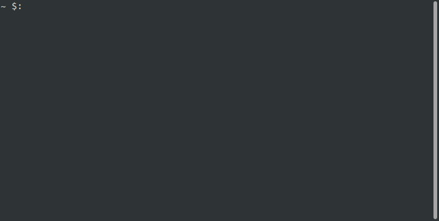

## pipex

project of École 42 where it is necessary to implement the shell commands `|` and `>` in C.

the program takes the infile, outfile to redirect the stdin, stdout and 2 commands to pipe.

the project was made in accordance with the school design code standard in C language.



### how to use
```
make
./pipex <infile> <cmd1> <cmd2> <outfile>
```
example:
```
./pipex infile cat "head -2" outfile
```
